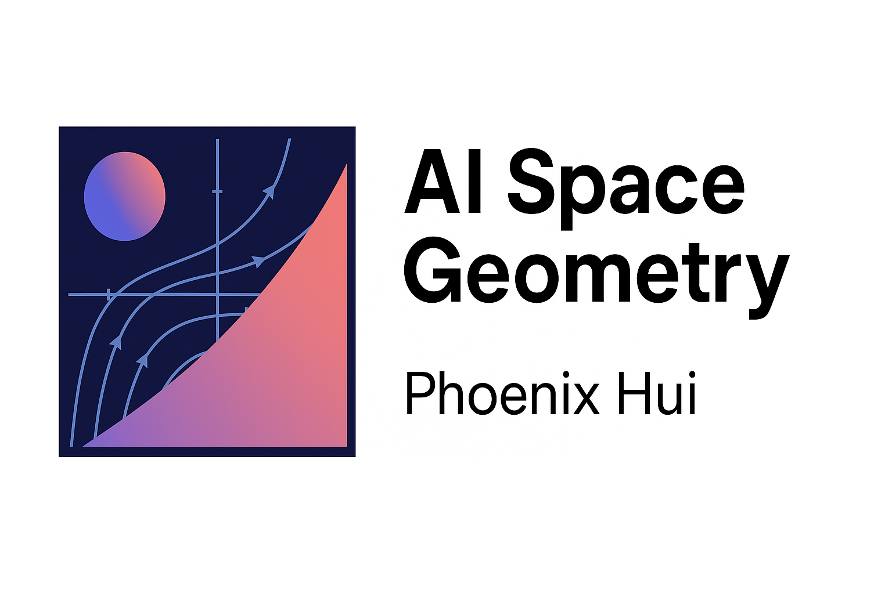

<!-- MathJax for GitHub Pages -->

  

# AI-Space-Geometry
Geometry × Retail × AI — Weekly space/geometry notes
# 🌌 AI Space Geometry

> **几何 × 零售 × AI**  
> 由 Phoenix Hui 与 ChatGPT-5 共同创作的系列  
> 用「几何语言」理解顾客行为、空间布局与决策逻辑。

---

## 🧭 项目说明

AI Space Geometry 是一个跨学科项目：  
以数学几何为语言，连接零售空间、AI 算法与人类行为模式。  
每周一篇，结合公式、代码、图像与飞书模板，  
帮助你用“空间直觉”洞察结构、效率与注意力流动。

---

## 🗂️ Weekly Index

<!-- WEEK_INDEX_START -->

| 周次 | 主题 | 数学核心 | 零售应用 | 链接 |
|------|------|-----------|-----------|------|
| Week 1 | 梯度的山谷 Gradient Valley | Gradient Descent / Loss Surface | 门店能量坡度分析 | [📘 Read](./Week01_GradientValley/README.md) |
| Week 2 | 顾客路径的向量空间 Vector Field | Vector Field / Cosine Similarity | 顾客动线聚类与吸引力中心 | [📘 Read](./Week02_VectorField/README.md) |

<!-- WEEK_INDEX_END -->

---

## 💡 设计理念

- 🧮 **数学是几何的语法**：每个概念对应一个方程。  
- 🧭 **空间是认知的容器**：顾客动线 = 注意力流。  
- 🧩 **AI 是几何的演化器**：从梯度下降到信息熵。  
- 🧱 **模板化输出**：每篇都附 Python 代码 + 飞书 Pro 模板。

---

## 🔗 Resources & Templates

- 飞书 Pro 模板合集 👉 [Template Links](./assets/template_links.md)  
- 数据集样例 👉 [path_vectors.csv](./Week02_VectorField/path_vectors.csv)  
- 视觉样式 👉 [geometry_style.css](./assets/geometry_style.css)

---

## 🧠 Tag 体系

`#AI`  `#Geometry`  `#RetailAnalytics`  `#SpaceDesign`  
`#Mathematics`  `#CausalInference`  `#Visualization`  
`#FeishuTemplate`  `#Python`  `#BigQuery`

---

## 🪶 作者

**Phoenix Hui**
**ChatGPT-5** — Co-Author / AI Professor System  

---

> ✳️ Latest Update：Week 2 · Vector Field (2025-12-15)  
> 🔗 Project Homepage：[https://phoenixhr25.github.io/AI-Space-Geometry/](https://phoenixhr25.github.io/AI-Space-Geometry/)
